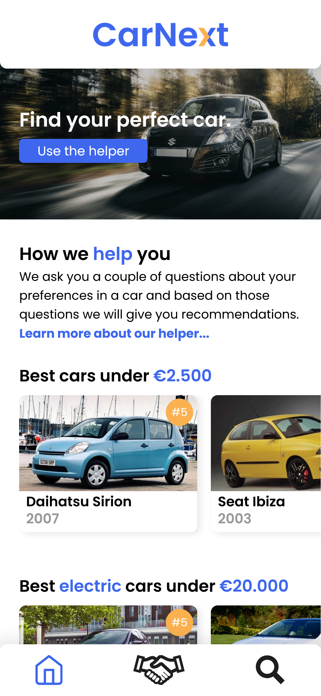
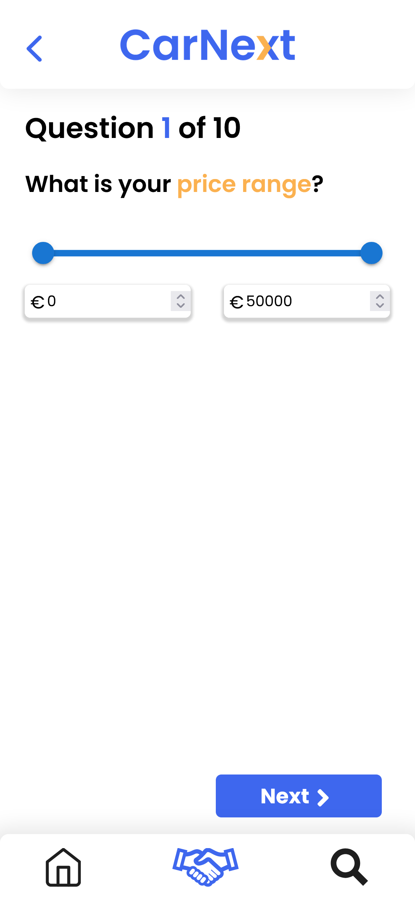
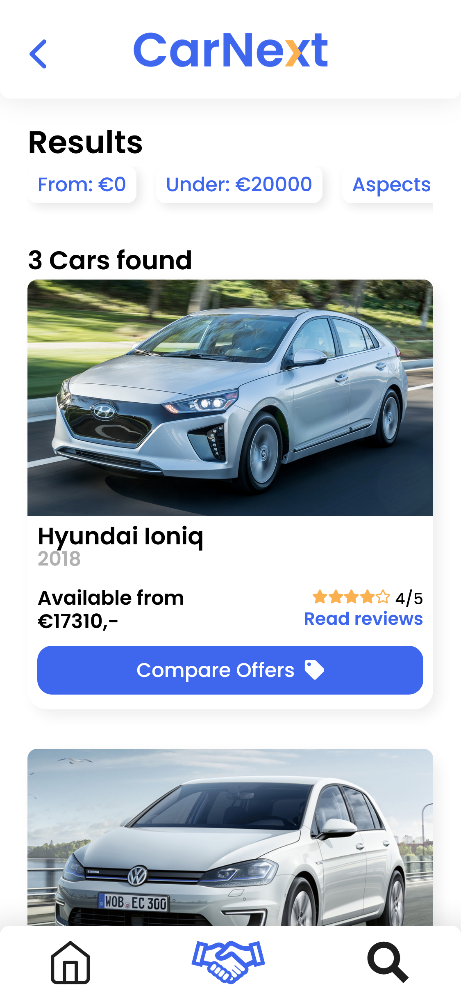
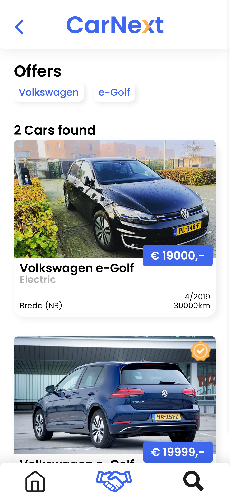
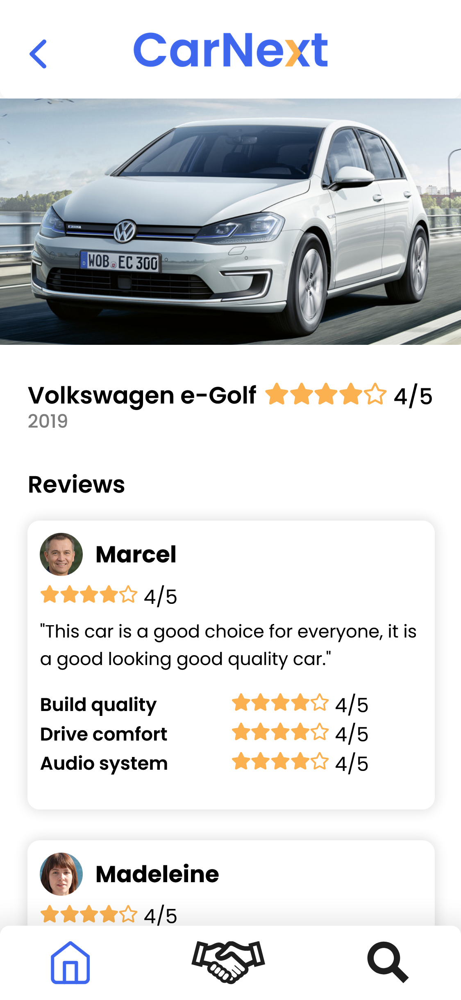

# Carnext App

Carnext is een app waarmee gebruikers opzoek kunnen gaan naar de voor hun meest geschikte auto en hiervan te koop aangeboden auto's bekijken. De app stelt de gebruiker een aantal makkelijke vragen die betrekking hebben tot wat de ideale auto moet kunnen en hebben.

    

## Aan de slag

Om een werkend kopie van dit project op je eigen apparaat te krijgen moet je de volgende stappen volgen:

1. Clone deze git repository in uw eigen code editor (VSCode).
2. Zodra hij gecloned is typt u in de terminal: (als deze nog niet open is ctrl + `)

```
npm install
```

3. Als de installatie is voltooid typt u in de terminal:
```
npm start
```

## How to use

Via de navigatiebalk aan de onderkant van het scherm kunt u navigeren naar de verschillende pagina's. 
* Home - Via hier kom je terecht op de home pagina van de app.
* Helper (handjes) - Via hier kom je terecht bij de vragen of resultaten van de helper.
* Search - Via hier kom je terecht op de offer zoekpagina.

## Gebouwd met

* HTML, CSS & JS
* React JS
    * React Router
    * React Beautiful dnd
* MUI
* Font Awesome/React Icons
* Firebase
    * Firestore

## Auteurs

* Daan Kleinen
* Kevin van Loon
