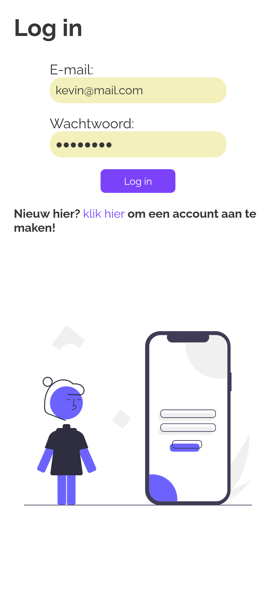
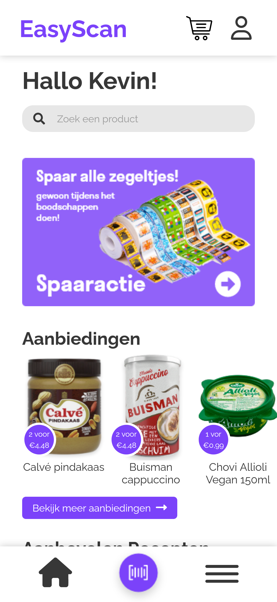
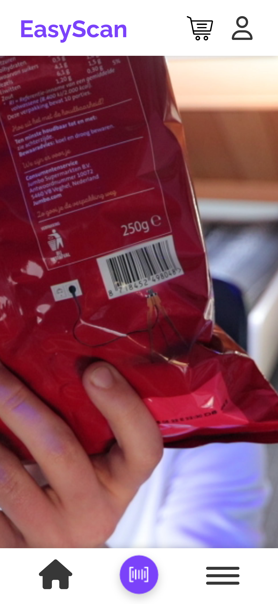
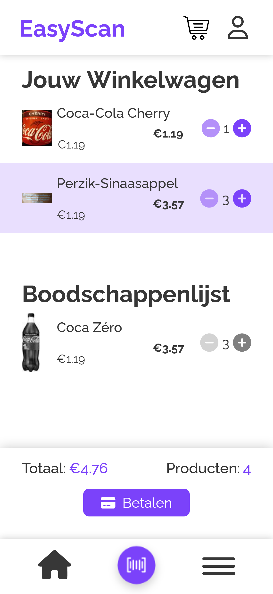
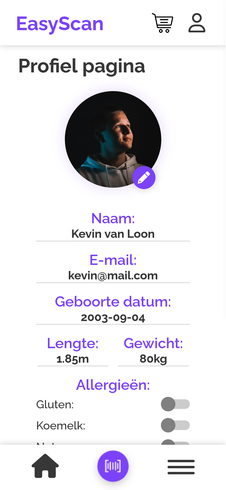

# EasyScan

#### Wat is EasyScan:

EasyScan is een scan app voor supermarkten waarmee klanten zelf hun producten kunnen scannen doormiddel van hun eigen device. Ook kunnen klanten gebruik maken van een digitale boodschappenlijst, drukte checker, aanbevolen recepten, in app betalen en nog meer.







## Project status

Dit project is nog niet volledig, er missen nog meerdere punten zoals: het betalen is tot nu toe alleen in mock-versie, routes zijn gemockt, er mist database die met meerdere producten en recepten is gevuld. 

## Installatie en Setup instructies 

Om deze repository te gebruiken zul je `node` en `npm` op je machine geïnstalleerd moeten hebben.  

Installatie:

```
npm install
```  

Test suite runnen  

```
npm test
``` 

Starten van de development server:

```
npm start
```

De build van de app klaar maken:

```
npm build
```

## Gemaakt met

* React - Gebruikte programmeertaal
* React Router
* React QR barcode scanner
* React Swipeable-Views
* React Icons
* React multi carousel
* Firestore - Data opslag
* Firebase authentication
* Firebase storage
* OpenFoodFact API
* Font Awesome
* PWA - Progressive Web App

## Advies

De app is nog niet volledig af. Ons advies is daarom ook de app verder af te maken. De functies die nog (af)gemaakt moeten worden zijn: 
* Routeplanner - Route langs alle producten op boodschappenlijst o.b.v. schappenplan winkel
* Recepten - Uitbreiden aantal recepten en aanraden o.b.v. voorkeuren en allergieën
* Aanbiedingen - Elke week andere aanbiedingen en ook baseren op basis van voorkeuren en allergieën
* Bonnetjes - Elke keer dat er afgerekend wordt het bonnetje daarvan toevoegen aan de lijst met alle bonnetjes
* Betalen - Werkend betaalsysteem d.m.v. bijvoorbeeld iDeal
    * Nieuwe barcode generen nadat betaald is om winkel te kunnen verlaten
* Druktecheck - O.b.v. locatie dichtsbijzijnste winkels tonen i.c.m. drukte
* Styling - Styling aanpassen m.b.t. de desbetreffende winkel huisstijl

## Auteurs

* Kevin van Loon
* Raf Schapendonk
* Daan Kleinen
* Darchinou Girigorie
* Geert Verstijnen
* Mike van Tienoven

AXI-groep2, Semester 3 ICT & Media Design
